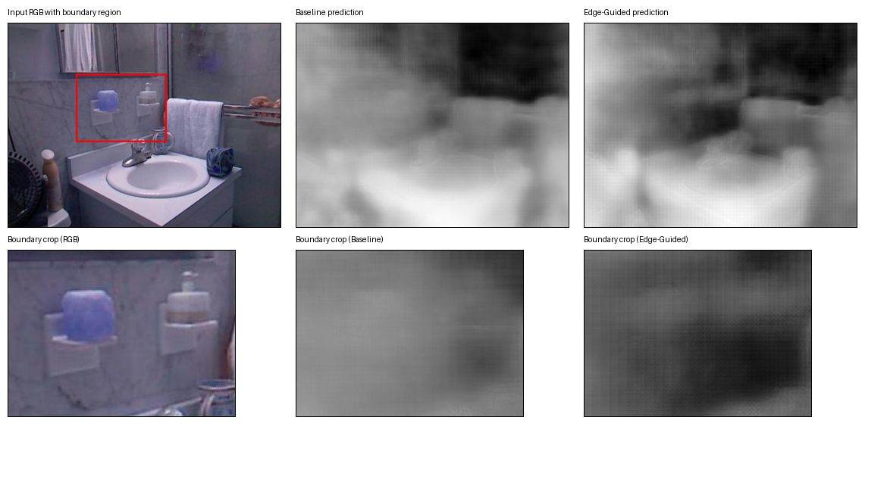
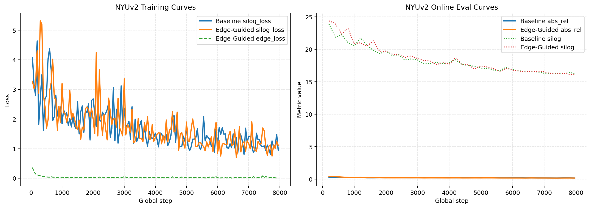
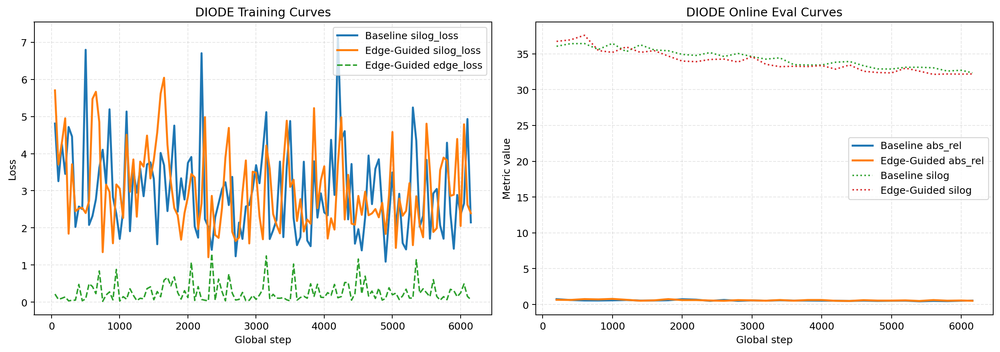
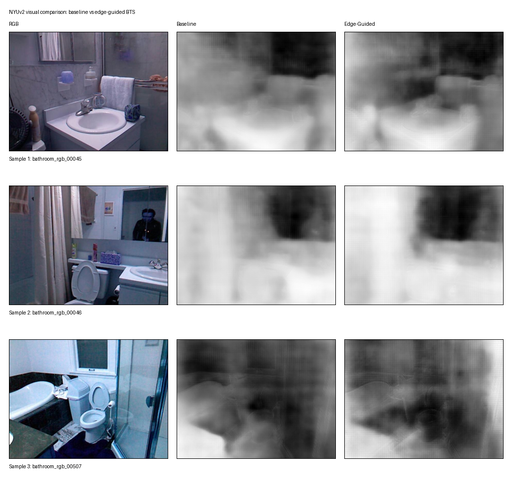
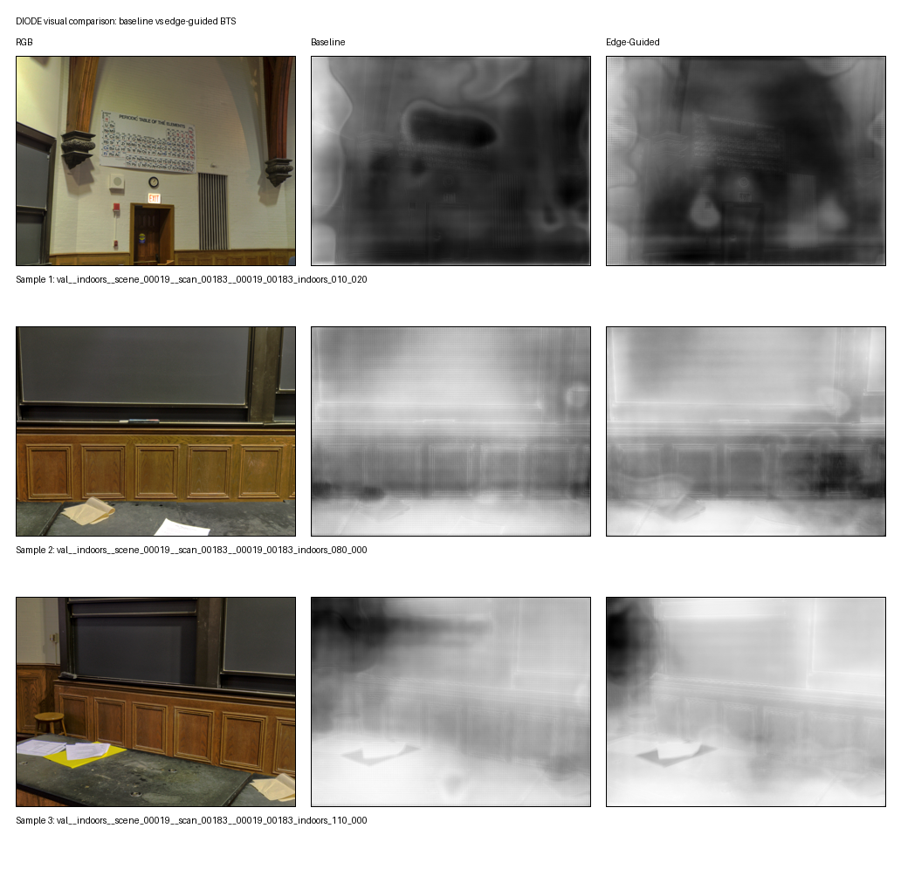
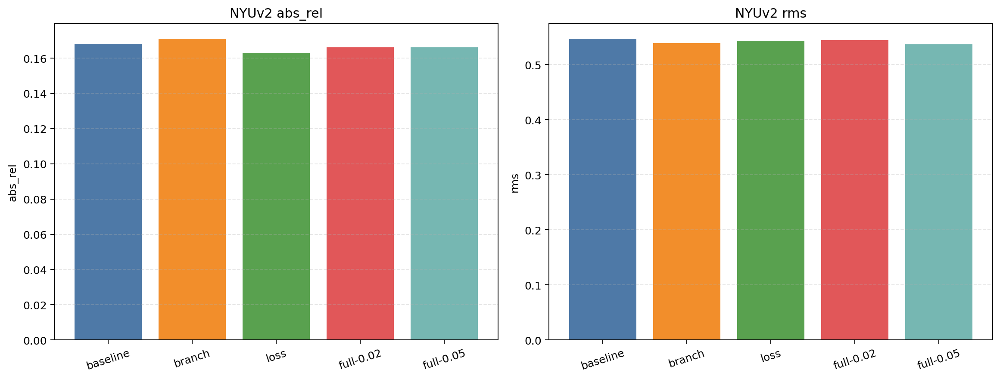
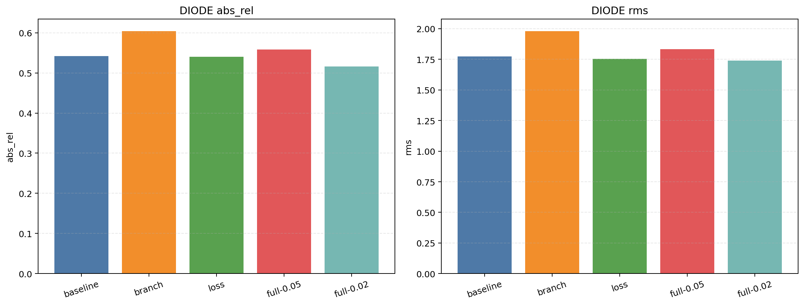
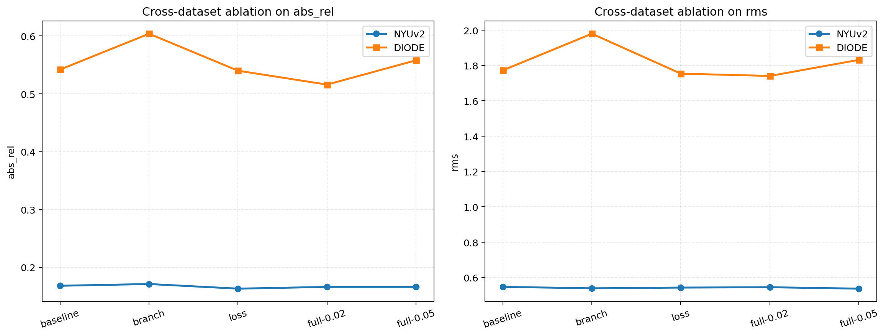

# 基于边缘引导细化的 BTS 单目深度估计改进方法

## 摘要

单目深度估计旨在从单张 RGB 图像中恢复场景的像素级深度信息，是三维场景理解、机器人感知和自动驾驶中的重要基础任务。针对原始 BTS 模型在物体边界区域深度预测容易出现模糊和过平滑的问题，本文提出一种基于边缘引导细化的 BTS 改进方法。该方法在原始 BTS 解码器末端增加轻量边缘分支，利用边缘特征对最终深度重建过程进行细化，同时引入由深度真值图构造的边缘监督损失，以增强模型对深度突变区域的建模能力。

本文在 NYUv2 和 DIODE 两个数据集上完成了 baseline 复现、改进模型训练、对比实验和消融实验，并与 BTS、GuidedDecoding 两种方法进行比较。实验结果表明，所提出的 Edge-Guided BTS 在两个数据集上均优于原始 BTS baseline。其中，在 NYUv2 上最佳模型 `bts_nyu_edgeguided_w005` 取得 `silog=16.077`、`abs_rel=0.166`、`rms=0.537`；在 DIODE 上最佳模型 `bts_diode_edgeguided_w002` 取得 `silog=32.192`、`abs_rel=0.516`、`rms=1.741`。消融实验进一步表明，模型性能提升主要来自边缘监督损失与边缘引导结构的协同作用，其中边缘监督损失是更加稳定的收益来源。

关键词：单目深度估计；BTS；边缘引导；边缘损失；消融实验

## 1. 实践目的

本次课程设计的实践目的，并不仅仅是“把一个开源项目跑通”，而是希望围绕一个相对完整的计算机视觉任务，经历从问题理解、基线复现、方案设计、实验验证到结果总结的全过程。相比只完成单次训练或简单展示结果，这种实践方式更强调对任务本身和模型行为的真正理解。

首先，本项目希望通过单目深度估计这一典型三维视觉任务，掌握其基本问题定义、研究价值与主流评价方式。单目深度估计的输入只是普通 RGB 图像，而输出却是像素级深度信息，这使它同时涉及图像理解、空间几何建模和数值回归等多个方面。通过该任务的实践，可以更具体地理解“二维图像如何映射为三维结构”这一视觉问题的基本难点。

其次，本项目希望通过复现 BTS、GuidedDecoding 等已有方法，学习并熟悉开源深度学习模型的训练与评估流程。课程设计中的工程难点往往并不完全来自网络结构本身，还包括环境搭建、数据组织、参数配置、日志记录、评估兼容和结果管理等一系列实现细节。只有真正把这些步骤走通，才能把“看懂论文”和“能做实验”区分开来。

再次，本项目希望在稳定复现 baseline 的基础上，围绕具体缺陷设计一个合理、可训练、可验证的改进方案。也就是说，目标不是为了创新而创新，而是从 baseline 的实际误差现象出发，找到一个确实值得改进的问题，再提出与该问题直接对应的结构性或损失性增强方法。本文最终选择从边界区域建模不足这一现象入手，正是出于这样的考虑。

此外，本项目还希望通过系统的对比实验和消融实验，训练对实验结果进行分析和解释的能力。一个方法即使取得了更好的指标，也不能自动说明“它为什么有效”。只有通过不同模型版本之间的比较，特别是通过对关键模块进行拆分验证，才能更清楚地说明性能提升究竟来自结构改动、监督改动，还是两者的共同作用。

最后，本次课程设计还希望形成一套较完整的课程成果，包括可运行代码、实验记录、结果整理、图表绘制和书面报告。换言之，本项目的目标不仅是完成某一项局部任务，而是尽可能按照一次小型研究实践的标准，把“问题提出 - 方法设计 - 实验验证 - 结果总结”这一链条完整走完。

## 2. 课题背景与意义

深度信息是计算机视觉系统理解三维世界的重要依据。在二维图像中，像素只携带颜色和纹理，而真正与空间位置、物体距离、遮挡关系、场景层次直接相关的信息，则更多体现在深度维度上。对于机器人导航而言，深度能够帮助系统判断前方是否存在障碍物以及障碍物距离有多远；对于增强现实而言，深度能够帮助虚拟物体与真实环境进行更合理的遮挡和对齐；对于自动驾驶和三维重建而言，深度更是场景理解和空间推理不可缺少的基础信息。

在获取深度信息的方案中，双目视觉、结构光、ToF 相机和激光雷达都属于较常见手段。这些方案通常能够直接或间接获得较准确的深度测量，但往往依赖额外硬件，系统成本较高，部署条件也更复杂。相比之下，单目深度估计仅依赖普通 RGB 图像，输入来源简单、硬件门槛低、适用场景广，因此长期以来都是计算机视觉研究中的一个核心问题。它的吸引力恰恰在于：只凭一张普通图像，是否有可能尽可能准确地恢复三维场景结构。

然而，单目深度估计之所以具有研究价值，也正是因为它困难。单张二维图像到三维深度之间并不存在唯一映射关系，同一种图像模式可能对应多种真实场景结构。换言之，单目深度估计是一个典型的病态问题。网络之所以能够在这一任务上取得效果，很大程度上依赖于它从大量数据中学习到的统计规律，例如室内场景中地板通常在下方、墙面通常连续、人体轮廓通常对应前景等。这也意味着，一旦场景结构复杂、局部遮挡明显或者边界区域信息不足，模型就容易出现错误。

近年来，基于深度学习的单目深度估计方法取得了显著进展。研究者通过编码器-解码器结构、多尺度特征融合、局部几何约束、注意力机制、Transformer 表达以及跨数据集迁移等方式不断提高深度预测精度。尤其是 BTS、DPT、ZoeDepth 等方法，已经在多个标准数据集上展示出较强性能。这说明，单目深度估计已经不再只是一个“完全无法解决”的问题，而是进入了“如何进一步提升精度与鲁棒性”的阶段。

尽管如此，当前方法仍然普遍存在一些比较顽固的问题。其中最典型的，就是边界区域、细小结构区域和深度突变区域的恢复质量往往明显落后于整体平面区域。很多模型在大面积墙面、地面、桌面等区域能够给出相当平滑、稳定的预测，但一旦遇到物体轮廓、遮挡交界、细杆状结构、桌角、门框、镜子边缘等位置，预测结果就容易变得模糊、拖尾甚至出现前后景混叠。这类问题在定量指标中未必总是最突出，但在视觉质量和实际应用中往往非常关键。

对于课程设计而言，单目深度估计是一个非常适合开展工程实践与算法改进的课题。其原因主要有三点。第一，它拥有较成熟的公开基线和标准数据集，可以保证实验具有可复现性和可比较性；第二，它拥有较完整的评价体系，可以从多个指标角度判断模型优劣；第三，它在结构设计上仍然存在不少可分析、可针对性增强的空间，因此既适合做工程复现，也适合做小规模但有明确动机的改进研究。

因此，在可控工作量内对已有模型进行结构和损失层面的创新，不仅具有技术意义，也具有较强的训练价值。通过这一过程，可以更深入地理解深度估计模型为什么有效、为什么会失败、改进应该围绕什么问题展开，以及如何通过实验去证明一个想法是否真正成立。这些能力，对于课程学习和后续独立开展视觉研究实践都具有现实意义。

## 3. 课题分析

### 3.1 问题定义

单目深度估计的目标是：输入一张 RGB 图像，输出与之对应的像素级深度图。这里的“像素级”意味着，图像中的每一个像素都对应一个深度值，因此该任务并不是只判断“哪些区域近、哪些区域远”，而是要尽可能细致地恢复整个场景的空间层次关系。

从任务要求来看，一个理想的单目深度估计模型至少应当满足两个层面的目标。第一个层面是整体层面，即模型应当在全局结构上给出合理的深度关系，例如地面通常向远处逐渐延伸，前景物体通常相对更近，背景区域通常相对更远。第二个层面是局部层面，即模型不仅要在整体误差指标上表现良好，还要在物体轮廓、遮挡边界、细长结构和深度跳变区域保持稳定、清晰的预测。只有同时满足这两个层面，深度图才既“数值上合理”，又“视觉上可信”。

### 3.2 现有方法的不足

在阅读文献和实际复现过程中可以发现，许多单目深度估计模型虽然在标准评价指标上已经达到较高水平，但仍然存在一些共性不足。这些不足并不一定意味着模型整体无效，而是说明当前方法在某些关键区域和关键场景下仍然不够稳健。典型问题主要包括以下几个方面：

1. 全局结构基本正确，但边界区域深度过于平滑。
2. 物体轮廓容易与背景混叠，造成目标边缘附近误差较大。
3. 模型主要通过深度回归损失学习整体分布，对边界区域的显式监督不够。

如果进一步解释，上述问题之间实际上是相互关联的。很多模型之所以会在边界位置表现较差，并不是因为它完全不知道哪里是物体轮廓，而是因为训练目标更偏向整体误差最小化，导致网络在优化时倾向于优先保证大面积区域的平均正确性，而不是优先保证边界位置的锐利性。对于深度估计来说，这种倾向往往会把边界附近的真实深度跳变“平均掉”，从而得到一种视觉上偏模糊、但整体上仍可接受的结果。

此外，很多深度估计模型在网络结构上更强调全局语义理解和区域连续性，这对于大面积平面和整体场景布局当然是有益的，但也可能间接削弱对局部不连续区域的敏感度。因此，如何在保持全局结构稳定的同时，提高对边界、轮廓和深度突变区域的表达能力，就成为一个值得专门分析的问题。

### 3.3 选择 BTS 作为创新底座的原因

本项目最终选择 BTS 作为主创新底座，原因如下：

1. BTS 在当前本地环境中的训练和评估流程最稳定。
2. BTS 的局部平面指导机制具有较强的几何表达能力，原始性能较好。
3. BTS 的解码过程清晰，便于在后端增加轻量模块而不破坏整体结构。
4. 相比之下，GuidedDecoding 更适合作为对比方法，而不是主创新干线。

在这四点之外，选择 BTS 还有一个重要原因，即它的“问题形态”非常适合做局部增强型改进。BTS 的整体结构已经比较成熟，主干性能也较稳定，因此当它在某些区域出现问题时，往往更容易判断这些问题来自哪里。例如，当观察到其在边界位置容易过平滑时，就比较自然地想到应从边界建模和边界监督两个方向进行补充。这种“缺陷可定位、改进可插入”的特征，使 BTS 成为课程设计中非常合适的创新底座。

### 3.4 创新切入点分析

通过对原始 BTS 结果和常见误差现象的观察，可以把改进切入点放在“边界区域建模不足”上。进一步分析后，本文认为可以从两个角度增强模型：

1. 结构角度：增加一个轻量边缘分支，让模型显式提取边缘相关特征。
2. 监督角度：增加边缘损失，让模型在训练时更关注深度突变区域。

这种改进思路的优势在于：

1. 不需要替换主干网络，风险较小。
2. 计算代价相对可控，适合课程设计规模。
3. 可以通过消融实验分别分析边缘分支和边缘监督的作用来源。

进一步来看，这一切入点之所以合理，是因为它既来源于模型实际误差现象，也具有明确的工程可操作性。很多改进思路虽然在概念上听起来先进，但未必适合当前实验条件，例如完全替换主干、引入大规模跨模态监督、重新设计大尺寸 Transformer 模块等，都可能带来较高训练成本与适配难度。相比之下，边缘引导改进的优点在于：它针对的问题足够具体，新增结构足够轻量，理论动机和实验验证之间也更容易建立直接联系。

也就是说，本文的创新切入点不是“把网络做得更大”，而是“让网络在最容易出错的位置学得更准”。这种思路更加符合课程设计项目的目标，即通过较小但有针对性的改动，获得可以解释、可以验证、可以复现的性能收益。

从课程设计的创新表达角度看，本文的创新点可以进一步概括为以下三点：

1. 在不替换原始 BTS 主干的前提下，将改进位置集中在解码末端，从而把创新聚焦在边界细化这一最具体、最易出错的问题上；
2. 将边缘分支、边缘引导融合和边缘监督损失联合设计，而不是只增加单一辅助头，使边界信息既能被学习，又能真正参与最终深度恢复；
3. 在 NYUv2 与 DIODE 两个风格差异明显的数据集上，同时通过对比实验和消融实验验证方法有效性，从而不仅展示“结果更好”，也解释“为什么更好”。

本节采用如下问题分析示意图：

图 3-1 原始单目深度估计在边界区域的典型误差示意图

下图已基于本地实验结果自动生成，对比了原图、baseline 预测、改进模型预测以及边界局部放大区域，可直接用于正文插图：



图中六张子图分别表示：

1. 第一行左图：输入的 RGB 原图，并用红框标出后续重点观察的边界区域。
2. 第一行中图：原始 BTS baseline 的整图深度预测结果，用来展示未引入边缘引导时的整体输出形态。
3. 第一行右图：Edge-Guided BTS 的整图深度预测结果，用来与 baseline 做整体视觉对比。
4. 第二行左图：从原图中裁剪得到的边界局部放大区域，用来明确观察对象的真实纹理、结构和遮挡关系。
5. 第二行中图：baseline 在对应局部区域的放大结果，可以看到边界附近存在较明显的过平滑现象，前景与背景的深度过渡不够清晰。
6. 第二行右图：改进模型在同一局部区域的放大结果，可以看到边界位置的层次变化更集中，局部轮廓相比 baseline 更清楚。

该图的作用不是单独证明数值指标提升，而是从定性角度说明：原始单目深度估计模型在边界区域确实容易出现模糊和混叠，而边缘引导改进正是针对这一问题提出的。

插图文件路径：`report/assets/figures/fig_3_1_problem_analysis.png`  
若后续希望替换成更规范的示意风格，可使用提示词文件：`report/assets/ai_prompts/fig_3_1_problem_analysis_prompt.md`

## 4. 算法介绍

本节重点介绍算法原理，而不是代码调用过程。

本节对应的网络结构图建议使用 AI 生成：

图 4-1 Edge-Guided BTS 总体结构示意图

该图建议使用 AI 绘制为更规范的结构框图。已准备好可直接投喂的提示词文件：

- 提示词路径：`report/assets/ai_prompts/fig_4_1_overall_architecture_prompt.md`
- 预留插图位置：`图 4-1`

### 4.1 原始 BTS 算法原理

BTS 是一种典型的编码器-解码器式单目深度估计方法，但它与一般“直接回归深度图”的方法并不完全相同。传统的卷积神经网络做单目深度估计时，常见思路是让网络输入一张 RGB 图像，经过若干卷积和上采样操作之后，直接输出与原图同尺寸的深度图。这种方法在工程上实现简单，也容易训练，但它本质上还是把深度估计理解为一种逐像素回归问题，即网络需要“记住”什么样的图像模式对应什么样的深度值。

这种纯回归式思路存在一个天然局限：深度估计并不是普通的二维分类问题，它本质上与三维几何结构密切相关。对于同一张图像中的局部区域而言，像素之间的深度关系并不是完全独立的，而往往具有一定的空间连续性、表面一致性和几何变化规律。如果网络只是在最后阶段对每个像素分别给出一个数值，那么它虽然可能学到“整体上哪个区域更近、哪个区域更远”，却不一定真正学会了局部空间结构应该如何组织。

原始 BTS 的关键贡献，就在于将这种“局部空间结构”显式引入到深度恢复过程中。它的核心思想不是在最后一步一次性回归高分辨率深度图，而是利用局部平面指导机制，在多个尺度上逐步恢复深度结构。更直白地说，BTS 认为：在局部范围内，真实场景的深度变化往往可以被一个简单的小平面近似描述。即使场景整体非常复杂，在较小窗口中，墙面、桌面、地面、柜门甚至一些物体表面，都常常表现出近似平面化的几何趋势。因此，与其让网络直接逐像素去“猜”深度，不如让它先预测这些局部几何结构，再由结构推导深度。

原始 BTS 的主要流程如下：

1. 编码器提取输入图像的多层语义特征；
2. 解码器逐步上采样，并结合浅层跳连信息恢复空间分辨率；
3. 在多个尺度上预测局部平面参数，包括平面法向量和距离项；
4. 利用局部平面指导模块将平面参数转换为对应尺度的深度图；
5. 最后融合多尺度深度线索，得到最终深度结果。

其中，编码器部分的作用可以理解为“看懂图像内容”。它负责从输入图像中提取越来越抽象的语义特征，例如某一片区域更像墙面、地面、桌面、人体还是家具。深层特征虽然空间分辨率较低，但通常包含更丰富的场景级信息，这对于深度估计是非常重要的，因为深度判断往往并不只是依赖局部纹理，还依赖对物体类别和场景布局的整体理解。

解码器部分则承担“把抽象语义还原为像素级几何”的任务。由于编码过程会不断下采样，导致特征图分辨率下降，因此需要在后续阶段逐步恢复空间细节。BTS 通过上采样与跳连融合的方式，把深层语义特征与浅层空间细节结合起来，使网络既保留全局结构判断能力，又尽可能恢复局部细节。

然而，BTS 与普通解码器的真正区别，在于它不是单纯地把特征图上采样后直接输出深度，而是在多个尺度上引入了局部平面指导机制。所谓局部平面指导，可以理解为：网络在某个尺度下不直接预测每个像素的深度值，而是先预测一个局部平面的参数，再根据这个平面的表达形式为该区域中的像素计算深度。这一步相当于在网络内部加入了几何先验，使预测不再是毫无约束的数值回归，而是带有明确结构含义的空间重建。

这一思想的重要性在于，它把“深度图是什么样”转化为“局部表面应该如何变化”。前者更像单纯拟合结果，后者则更接近三维几何建模。也正因如此，BTS 往往能够得到更稳定、更平滑、整体一致性更强的深度结构，特别是在大面积平面区域或者连续表面区域，其表现通常优于简单的像素回归模型。

从实现效果上看，这种方法相较于直接像素回归具有明显优点：它在结构上引入了局部几何先验，因此整体深度结构通常更加稳定，预测图不容易出现大范围的随机噪声，也更容易保持表面连续性。但它的不足同样比较明确。由于局部平面表达更偏向区域一致性，它天然会鼓励模型在一个局部范围内给出比较平滑、比较统一的深度变化趋势。这样虽然有利于整体结构，但也容易牺牲边缘附近的细节分辨能力。

换句话说，BTS 的优点是“整体像样”，而其潜在问题是“边界可能不够锐利”。尤其在物体轮廓、遮挡交界、前景背景分离区域，真实深度往往存在明显跳变，此时局部平面假设并不总是理想成立。如果网络仍然倾向于用相对平滑的方式解释这些位置，就会出现边缘模糊、轮廓扩散、前后景深度过渡不清等问题。本文后续的改进工作，正是围绕这一缺陷展开。

本小节对应原理图建议使用 AI 生成：

图 4-2 原始 BTS 的多尺度局部平面指导原理示意图

该图建议使用 AI 绘制为几何原理图。已准备好提示词文件：

- 提示词路径：`report/assets/ai_prompts/fig_4_2_bts_lpg_prompt.md`
- 预留插图位置：`图 4-2`

### 4.2 本文改进方法的总体结构

本文提出的 Edge-Guided BTS，并不是重新发明一套与 BTS 完全不同的深度估计网络，而是在原始 BTS 已经具备较强整体性能的基础上，围绕其边界建模不足这一薄弱环节进行局部增强。这样的设计思路具有明显工程意义。对于课程设计而言，完全重建一套大型模型不仅代价高，而且风险大，容易引入大量与核心问题无关的不稳定因素。相反，在一个已经能够稳定训练、稳定评估、整体效果可靠的 baseline 上做针对性改进，更有利于验证创新是否真正有效。

从总体结构上看，本文的改进方法可以概括为“保留 BTS 主干，补充边缘感知，利用边缘信息细化最终深度恢复”。也就是说，原始 BTS 中负责全局语义理解和多尺度几何恢复的核心部分并没有被推翻，而是被完整保留下来。保留的部分包括：

1. 编码器结构不变；
2. 多尺度上采样解码流程不变；
3. `lpg8x8`、`lpg4x4`、`lpg2x2` 三个局部平面指导分支不变；
4. 深度主损失仍然以原始 BTS 的深度回归目标为核心。

在此基础上，本文仅在最终深度恢复前增加边缘引导细化模块。这里的“仅”并不意味着作用很小，而是强调改动范围是可控的、逻辑上是聚焦的。原始 BTS 已经能够较好地回答“整体上哪里近、哪里远”这一问题，因此本文并不打算改变其主干几何建模方式，而是要让网络在最后阶段进一步回答“边界到底在哪里、这些位置应该怎样被更谨慎地处理”。

更具体地说，本文改进方法的总体结构包含两个新增思想。第一个思想是增加边缘分支，让网络从浅层高分辨率特征中显式学习边界相关信息；第二个思想是增加边缘监督与边缘引导融合，让这些边界信息不仅被预测出来，而且真正参与最终深度图的形成过程。前者解决的是“网络能否看见边界”的问题，后者解决的是“网络看见边界后能否据此调整深度预测”的问题。

这种设计体现了一种很重要的建模原则：当发现原始模型在某类区域容易出错时，最合理的办法不是无差别地加深网络、堆叠更多层、引入大量复杂模块，而是先明确错误主要发生在哪里，再把针对该区域的先验信息以合适方式融入模型。本文认为，原始 BTS 的主要不足并不在于全局结构恢复失败，而在于边界区域容易过平滑。因此，边缘信息就是最自然的补充方向。

从信息流角度理解，原始 BTS 负责生成稳定的全局几何框架，而新增边缘模块则负责在最终阶段为这些框架加上一层“局部精修”。这种关系有点类似于先完成整体草图，再对轮廓线和交界处做精修处理。前者保证大的结构关系不出错，后者防止细节位置被粗糙地糊过去。这样的分工不仅符合网络现有结构特征，也符合人对场景几何恢复的直觉理解。

因此，本文的总体结构并不是“另起炉灶”，而是“在合适的位置加入合适的信息”。这使得整个改进方法既保留了 BTS 在整体结构建模上的优势，又为后续的边界细化提供了明确抓手，也为消融实验中的结构分析提供了清晰模块划分。

### 4.3 边缘分支原理

在解码器最后一级浅层特征 `skip0` 上，本文增加了一个轻量边缘分支。这个分支的目的，并不是去完成一个独立的传统边缘检测任务，而是专门服务于深度估计主任务，学习“哪些位置更可能对应深度不连续区域、轮廓交界区域或者前后景分离区域”。

从计算机视觉的基本规律来看，边缘信息是一种典型的局部高频信息。它依赖像素附近的变化关系，而不是大范围的全局平均结果。也就是说，判断一个位置是不是边界，更依赖其周围很小邻域内的强度变化、纹理变化、结构变化和几何变化。因此，边缘分支如果放在分辨率已经很低的深层特征上，往往很难准确定位边界；相反，如果从靠近输出端、仍保留较多空间细节的浅层特征出发，就更容易得到较清楚的边缘响应。

该分支由若干轻量卷积层组成，其任务是从浅层空间特征中提取边界敏感信息，并输出边缘预测图 `edge_logits`。这里之所以输出的是 logits 而不是直接输出概率，是因为在训练阶段使用 `BCEWithLogitsLoss` 更稳定，能够避免在数值上过早进入饱和区。待训练或推理时，再通过 `sigmoid` 将 logits 转换为边缘概率图 `edge_prob`，从而得到每个位置属于边界区域的相对可能性。

之所以选择在浅层特征上构造边缘分支，主要基于以下几方面考虑：

1. 浅层特征保留了更多局部纹理与空间细节；
2. 边缘检测本身更依赖局部对比和细粒度结构；
3. 在解码末端引入边缘信息可以直接作用于最终深度恢复过程；
4. 在主干末端增加轻量分支，能够以较低计算代价完成针对性增强。

这里需要特别说明，本文中的“边缘”并不等同于普通图像中的所有亮度边缘。图像里可能存在很多纹理边缘，例如墙面花纹、地砖纹理、布料褶皱、镜面反射变化等，这些位置在视觉上确实会出现灰度或颜色突变，但它们并不一定对应明显的深度变化。对于单目深度估计任务而言，真正重要的并不是所有视觉边缘，而是那些与几何结构变化密切相关的边界，例如物体轮廓、遮挡交界、平面终止位置、前景背景分界等。

因此，本文引入边缘分支的目的不是让网络“多检测一些边缘”，而是让网络“更敏感地感知与深度恢复最相关的边界”。这种边缘分支可以理解为一个面向深度任务定制的局部结构提取器。它输出的边缘图并不是最终产品，而是一种中间引导信息，其核心价值在于帮助后续深度预测更加重视几何不连续位置。

形式上，边缘分支可以理解为：

\[
F_{edge} = \phi(F_{skip0})
\]

\[
E = Conv(F_{edge})
\]

其中，`F_skip0` 表示浅层跳连特征，`\phi` 表示由卷积和非线性激活构成的特征提取过程，`E` 表示边缘预测 logits。

从公式意义上看，这一步实际上完成了从“普通浅层特征”到“边界敏感特征”的变换。`F_skip0` 原本只是解码过程中的一个浅层特征张量，其中包含纹理、位置和部分局部结构信息；经过函数 `\phi` 之后，网络被鼓励把这些信息重新组织为更有利于边界判别的表示；最后通过卷积映射得到单通道的 `E`，从而把原本分散的特征响应压缩成一个可解释的边缘预测图。这样的设计结构简单，但语义非常清楚：它让网络明确地区分“为深度整体恢复服务的主特征”和“为边界定位服务的辅助特征”。

### 4.4 边缘引导融合原理

仅仅预测边缘图还不够，还需要让边缘信息真正参与深度估计。否则，边缘分支就只是一个额外的辅助头，虽然在网络中存在，但不一定能够有效改变最终深度输出。为此，本文进一步设计了边缘引导融合机制，使边缘分支的输出能够直接作用于最终深度恢复阶段。

具体来说，本文将 `edge_logits` 经过 `sigmoid` 转为边缘概率图 `edge_prob`，并用于对最后一级上采样特征 `upconv1` 做乘性调制：

\[
F' = F \odot (1 + P_{edge})
\]

其中，`F` 是原始解码特征，`P_edge` 是边缘概率图，`\odot` 表示逐元素乘法。这个操作的含义是：在预测为边缘的位置上，放大网络的局部响应，使这些区域在最终深度恢复时获得更高权重。

这一设计的直观意义非常明确。边缘概率越高，说明该位置越可能对应几何边界，那么网络在该位置就不应完全沿用普通区域的平滑恢复方式，而应该更加关注局部细节和深度跳变信息。通过乘性调制，网络不会被强制写死某种输出模式，而是得到一种柔性的注意信号：边界位置值得被更认真地处理。

相比于简单把边缘图作为附加输入直接拼接到最后输出层之前，这种调制方式更有针对性。直接拼接虽然也能让网络“看到”边缘信息，但并不能保证这种信息在关键位置真正发挥作用；而乘性调制则相当于显式改变了特征响应强度，让边界线索先影响特征，再影响最终预测。换言之，本文不是简单把边缘图附着在网络尾部，而是让边缘图成为调节深度恢复过程的一种控制信号。

之后，本文将以下信息拼接后送入最终卷积层：

1. 边缘调制后的末端特征；
2. 原始 `reduc1x1` 特征；
3. 三个尺度的深度结果；
4. 边缘概率图。

这样做可以使最终深度预测同时利用：

1. 原始多尺度深度结构信息；
2. 末端局部边缘线索；
3. 边界位置显式引导。

这里的拼接操作同样不是随意设计的，而是体现了一种“整体结构与局部细节兼顾”的思想。如果只保留边缘调制后的特征，模型可能会过度偏向局部高频区域，从而削弱原始 BTS 的整体结构优势；如果只保留原始多尺度深度结果，则边缘分支又可能难以真正影响输出。因此，本文将边缘调制特征、原始 `reduc1x1` 特征、三个尺度深度结果以及边缘概率图共同送入最终卷积层，让网络自行学习这些信息之间的最优组合方式。

从功能上看，这一步相当于给最终深度预测提供了四类互补线索：一类是原始 BTS 已经擅长的多尺度结构信息；一类是靠近输出端的局部高分辨率语义；一类是边缘分支提取到的显式边界位置；还有一类是边界位置经过调制后所形成的特征强化结果。正是这种多源信息融合，使模型在保持原始结构稳定性的同时，有机会在关键边界区域作出更细致的判断。

因此，边缘引导融合机制可以被理解为一种后端细化策略。它并不改变原始 BTS 的主体几何恢复逻辑，而是在最终输出前增加一个“边界感知的动态调节层”。这类设计之所以适合本项目，是因为它改动小、逻辑清晰、容易解释，而且能够直接回应“为什么边界会改善”这一核心问题。

本小节对应融合机制图建议使用 AI 生成：

图 4-3 边缘分支与深度特征融合机制示意图

该图建议使用 AI 绘制为机制流程图。已准备好提示词文件：

- 提示词路径：`report/assets/ai_prompts/fig_4_3_edge_fusion_prompt.md`
- 预留插图位置：`图 4-3`

### 4.5 边缘监督损失原理

如果只引入边缘分支而不给监督，模型未必真的会学到对深度有用的边界信息。因此，本文进一步设计了边缘监督损失。这里的逻辑其实很关键：一个新分支是否有效，不取决于它是否被添加进网络，而取决于它是否被明确要求去学习某种对主任务真正有帮助的表示。如果没有监督信号，边缘分支很可能只是被动适应主损失，输出一些模糊的、不可解释的响应，最终并不能稳定改善深度结果。

具体做法是：从深度真值图 `depth_gt` 出发，构造一个边缘目标图 `edge_target`。其核心思想是利用深度图中局部差异较大的区域近似表示深度边界，再结合有效深度掩码限制监督范围。之所以可以这样做，是因为对于单目深度估计任务而言，我们真正关心的边界并不是普通图像边缘，而是几何意义上的深度突变位置。既然深度真值本身已经包含了三维结构信息，那么从深度真值中直接构造边界目标，就是一种自然且任务一致的监督方式。得到目标图后，使用二值交叉熵损失约束边缘预测：

在实现层面，这一监督目标并不是人工逐像素标注得到的，而是根据深度真值的局部变化自动构造。其基本过程可以概括为：

1. 先根据有效深度范围得到有效掩码 `M`，排除无效深度值和超范围像素；
2. 分别计算水平方向和垂直方向上的局部深度差分，例如

\[
\Delta_x(i,j) = |D(i,j) - D(i,j+1)|,\quad
\Delta_y(i,j) = |D(i,j) - D(i+1,j)|
\]

3. 将两个方向的差分响应进行合并，得到局部边界强度图，例如

\[
G(i,j) = \max(\Delta_x(i,j), \Delta_y(i,j))
\]

4. 再根据预设阈值 `\tau` 和有效掩码 `M` 将其二值化，得到最终边缘目标图：

\[
E_{gt}(i,j) =
\begin{cases}
1, & G(i,j) > \tau \text{ 且 } M(i,j)=1 \\
0, & \text{otherwise}
\end{cases}
\]

这里的阈值 `\tau` 用于控制“多大的深度跳变才被视为边界”。如果阈值过小，模型会把大量微弱波动也当作边界；如果阈值过大，则会漏掉部分真实轮廓。因此，该过程本质上是在“边界敏感性”和“监督稳定性”之间取平衡。虽然正文中不展开全部实现细节，但其核心思想是明确的，即只把那些具有明显几何深度突变且处于有效区域内的位置作为边缘监督对象。

\[
L_{edge} = BCEWithLogitsLoss(E, E_{gt})
\]

最终总损失为：

\[
L = L_{silog} + \lambda L_{edge}
\]

其中：

1. `L_silog` 是原始 BTS 使用的主要深度回归损失；
2. `L_edge` 是边缘监督损失；
3. `\lambda` 是边缘损失权重。

边缘损失的引入具有两层意义：

1. 它直接鼓励模型识别深度突变区域；
2. 它为边缘分支提供明确学习目标，从而避免边缘分支变成无效附加结构。

如果进一步分析，边缘监督损失至少承担了三项作用。

第一，它为网络增加了一个与主深度任务互补的优化目标。原始深度损失更关心整体预测值是否准确，而边缘损失则更关心关键结构位置是否被突出建模。两者并非相互替代关系，而是面向不同侧重点的联合约束。

第二，它提高了边缘分支的可解释性。没有监督时，边缘分支输出的响应图可能很难判断是否真正代表边界；有了由深度真值构造的 `edge_target` 之后，边缘分支的输出就可以直接与几何边界目标进行对比，这使得模型内部行为更加清楚，也有利于后续分析。

第三，它为消融实验提供了理论基础。因为本文不仅增加了结构，还增加了监督，所以必须通过实验区分“性能提升究竟来自边缘引导结构本身，还是来自边缘监督信号本身”。正因为 `L_edge` 是一个单独、清晰、可调节的模块，后续才能自然构造 `branch only`、`loss only` 和 `full model` 等不同实验设置。

当然，边缘损失并不是越大越好。若权重 `\lambda` 设置过大，模型可能会过度关注边界区域，导致整体深度结构学习受到干扰；若权重过小，边缘监督的效果又可能不足。因此，边缘损失的意义不仅在于“有没有加”，还在于“加得是否合适”。这也是为什么本文后续会在不同数据集上比较不同权重设置，并观察到 NYUv2 与 DIODE 对边缘监督强度的敏感性并不完全相同。

本小节对应监督构造图建议使用 AI 生成：

图 4-4 深度边缘监督目标构造示意图

该图建议使用 AI 绘制为监督目标构造流程图。已准备好提示词文件：

- 提示词路径：`report/assets/ai_prompts/fig_4_4_edge_target_prompt.md`
- 预留插图位置：`图 4-4`

### 4.6 三种实验版本的关系

为了验证改进到底来自哪一部分，本文构造了三类核心版本。这样做的原因在于：如果一个改进方法中同时包含多个新成分，而实验结果只显示“整体变好了”，那么仍然无法说明究竟是哪一部分在起作用。对于课程报告而言，这样的结论是不够扎实的。真正有说服力的分析，必须尽量把不同因素拆开，分别考察它们的独立作用和联合作用。

本文构造的三类核心版本如下：

1. `edge branch only`：只加边缘分支，不加边缘损失；
2. `edge loss only`：保留边缘监督头，但不做结构引导；
3. `full model`：同时加入边缘分支与边缘损失。

其中，`edge branch only` 的作用是检验“结构本身是否有价值”。如果只增加边缘分支，不给额外边缘监督，那么网络是否仍然能够从主任务中自发学到有用的边界信息？如果这个版本已经带来改善，说明边缘引导结构本身就具有一定潜力；如果效果不稳定，甚至出现退化，则说明仅靠结构增加并不足以保证边缘信息被正确利用。

`edge loss only` 的作用则是检验“监督本身是否有价值”。在这个设置下，模型虽然不显式使用边缘引导融合去调制最终特征，但仍然通过边缘监督头接受几何边界约束。如果这一版本也能带来稳定提升，就意味着即使不通过结构层面显式强化边缘，单独增加边缘学习目标本身也足以让网络在训练中更关注关键边界位置。

`full model` 则用于检验“结构与监督是否存在协同效应”。如果完整模型优于 `branch only` 和 `loss only`，就可以说明两者并不是彼此替代关系，而是各自承担不同功能：边缘监督负责告诉网络应该关注什么，边缘引导结构负责让这种关注真正影响最终深度恢复过程。前者解决“学什么”的问题，后者解决“怎么用”的问题。

这样的设计可以分别回答三个问题：

1. 结构本身是否有效；
2. 监督本身是否有效；
3. 二者结合是否比单独使用更好。

从实验设计方法论角度看，这一节内容其实非常重要。因为一篇完整的算法报告不仅要说明“提出了什么模块”，更要说明“模块之间的逻辑关系是什么，为什么要这样拆分实验”。本文在算法介绍部分提前把这三类版本的关系讲清楚，后续在消融实验部分再给出相应结果，就能够形成一个比较完整的论证闭环：先从原理上定义模块职责，再从实验上验证这些职责是否真的成立。这样写出的报告，不只是把代码跑通，更体现出对模型结构和实验逻辑的真正理解。

## 5. 实现细节

### 5.1 代码运行环境

所有实验统一在如下 conda 环境中运行：

- Python 环境：`D:\Anaconda_envs\PulseWeave`

项目主要依赖：

1. PyTorch
2. torchvision
3. 原始 BTS 开源代码
4. GuidedDecoding 开源代码

此外，为避免预训练模型和依赖缓存写入系统盘，所有脚本统一将缓存目录重定向至项目本地目录。这样做的直接好处有两点：一方面可以减少环境切换时的路径冲突与权限问题，另一方面也便于对实验依赖进行集中管理，保证项目在本机上的可重复执行性。

从工程实践角度看，课程项目能否顺利完成，往往并不只取决于模型本身是否正确，还取决于运行环境是否稳定。深度学习实验中常见的问题包括 CUDA 与 PyTorch 版本匹配、依赖库 API 变化、路径编码不一致、日志目录写入失败以及预训练权重缓存位置混乱等。为降低这些非算法因素带来的干扰，本文所有实验尽量在同一环境、同一目录结构和统一脚本约定下完成。这样做虽然不能直接提高模型性能，但能显著提升实验流程的稳定性和可追溯性。

### 5.2 数据集与划分

#### NYUv2

- 训练集目录：`data/nyuv2/official_splits/train`
- 测试集目录：`data/nyuv2/official_splits/test`
- 训练文件列表：`data/nyuv2/bts_inputs/nyu_train_official.txt`
- 测试文件列表：`data/nyuv2/bts_inputs/nyu_test_official.txt`

在 NYUv2 上，训练和测试采用官方划分，在线评估阶段直接使用测试划分进行周期性验证。

#### DIODE

- 数据根目录：`data/diode`
- 训练列表：`data/diode/bts_inputs/diode_train.txt`
- 验证列表：`data/diode/bts_inputs/diode_val.txt`
- 测试列表：`data/diode/bts_inputs/diode_test.txt`

在 DIODE 上，训练阶段使用 `diode_train.txt`，在线评估阶段使用 `diode_val.txt`，最终测试阶段使用测试划分。

之所以同时使用 NYUv2 和 DIODE 两个数据集，是因为它们在场景属性上具有明显差异。NYUv2 主要是室内场景，图像中包含墙面、地面、桌椅、卫生间、办公室等典型 indoor 结构，深度范围相对有限，空间布局也较规则，因此更适合检验模型在室内结构化环境下的恢复能力。DIODE 则同时包含室内和室外场景，场景变化更大、几何形态更复杂、光照和材质条件也更加多样，因此更能考验模型的泛化能力与鲁棒性。

从实验设计角度看，使用两个风格差异明显的数据集有助于避免“只在单一数据分布下有效”的结论。若某种改进方法只在 NYUv2 这类相对规整的室内环境中有效，而在更复杂的 DIODE 场景中失效，那么就说明该方法的收益可能具有明显场景依赖性。相反，若它在两个数据集上都能带来提升，则更能说明其改进方向具有一定普适性。

本节数据集统计表如下：

表 5-1 NYUv2 与 DIODE 数据集划分统计表

| 数据集 | 训练集 | 验证集 | 测试集 | 场景类型 | 最大深度 | 划分说明 |
|---|---:|---:|---:|---|---:|---|
| NYUv2 | 795 | 654（在线评估复用测试划分） | 654 | 室内 | 10 | 官方划分 |
| DIODE | 308 | 79 | 76 | 室内/室外 | 10 | 本地划分文件 |

表格文件路径：

- `report/assets/tables/table_5_1_dataset_split_stats.md`
- `report/assets/tables/table_5_1_dataset_split_stats.csv`

### 5.3 训练超参数

本文训练设置主要来源于本地稳定运行版本配置文件，核心参数如下：

表 5-2 主要训练超参数设置

| 参数 | NYUv2 | DIODE |
|---|---|---|
| 编码器 | `densenet121_bts` | `densenet121_bts` |
| batch size | 2 | 2 |
| epoch 数 | 20 | 20 |
| 初始学习率 | `1e-4` | `1e-4` |
| weight decay | `1e-2` | `1e-2` |
| Adam epsilon | `1e-3` | `1e-3` |
| 输入尺寸 | `416 x 544` | `416 x 544` |
| 最大深度 | 10 | 10 |
| 线程数 | 0 | 0 |
| 日志频率 | 50 step | 50 step |
| 保存频率 | 200 step | 200 step |
| 在线评估频率 | 200 step | 200 step |

学习率在训练过程中采用多项式衰减策略逐步下降。模型训练时同时记录：

1. 深度主损失；
2. 边缘损失；
3. 学习率；
4. 深度预测与边缘预测可视化结果。

这些超参数设置总体遵循“优先稳定，再谈改进”的原则。由于本项目的重点并不是重新搜索一套极致最优的训练超参数，而是在可控条件下比较 baseline 与改进模型之间的差异，因此训练策略尽量保持一致，使不同模型版本之间的比较更加公平。换言之，本文希望把性能变化尽可能归因于结构和损失设计，而不是归因于训练轮数、学习率或 batch size 的偶然变化。

其中，`batch size=2` 反映了本地实验环境下对显存和训练稳定性的综合权衡；`epoch=20` 则保证模型既能完成基本收敛，又不会把训练时间拉得过长，适合课程设计周期内的多轮对比实验。日志记录频率、保存频率和在线评估频率统一设置为相近尺度，也有利于后续从 TensorBoard 和结果目录中统一整理训练曲线与验证趋势。

### 5.4 数据增强与评估设置

在 NYUv2 上，训练阶段启用了随机旋转增强：

- `--do_random_rotate`
- `--degree 2.5`

在评估阶段：

1. NYUv2 使用 `eigen_crop`；
2. 深度评估最小阈值为 `1e-3`；
3. 深度评估最大阈值为 `10`。

训练时有效深度范围设置为：

1. `NYUv2`：`0.1 < depth < max_depth`
2. `DIODE`：`1.0 < depth < max_depth`

在数据增强方面，本文并未采用过于激进的图像变换，而是尽量遵循原始 BTS 在对应数据集上的常见设置。原因在于，课程设计中的主要目标是验证边缘引导改进本身是否有效，如果同时大幅改变数据增强策略，就会引入额外变量，使结果解释变得不够清楚。随机旋转增强的作用主要是提高模型对轻微视角变化的适应能力，同时不会显著破坏室内场景和普通拍摄场景的几何一致性，因此属于较稳妥的增强方式。

评估设置方面，`eigen_crop`、最小深度阈值和最大深度阈值等参数都直接影响最终指标数值，因此在实验中保持统一尤为重要。深度估计任务中的很多指标对无效区域、极小深度值和极大深度值都比较敏感，如果不同实验组采用不同的裁剪与评估范围，就会导致结果失去横向可比性。本文在 baseline 与改进模型之间保持相同评估设置，正是为了确保实验结论建立在同一标准之上。

### 5.5 本文改进版本的具体配置

#### NYUv2

1. baseline：不使用边缘分支，不使用边缘损失；
2. `full w=0.10`：使用边缘分支，`edge_loss_weight = 0.10`；
3. `full w=0.02`：使用边缘分支，`edge_loss_weight = 0.02`；
4. `full w=0.05`：使用边缘分支，`edge_loss_weight = 0.05`；
5. `branch only`：使用边缘分支，`edge_loss_weight = 0.00`；
6. `loss only`：不使用边缘引导融合，只启用边缘监督头，`edge_loss_weight = 0.05`。

#### DIODE

1. baseline：不使用边缘分支，不使用边缘损失；
2. `full w=0.05`：使用边缘分支，`edge_loss_weight = 0.05`；
3. `full w=0.02`：使用边缘分支，`edge_loss_weight = 0.02`；
4. `branch only`：使用边缘分支，`edge_loss_weight = 0.00`；
5. `loss only`：不使用边缘引导融合，只启用边缘监督头，`edge_loss_weight = 0.02`。

这里可以看出，本文在两个数据集上并没有完全机械地使用同一套边缘损失权重，而是根据实验观察分别设置了不同候选值。这样做的原因在于，NYUv2 与 DIODE 的场景复杂度、深度分布和边界形态并不完全相同，因此模型对边缘监督强度的敏感性也很可能不同。如果强行要求二者使用完全一致的权重，只会降低实验对数据集差异的解释能力。

具体而言，NYUv2 中室内结构边界较规则、深度范围也相对集中，因此适当偏强的边缘监督可能仍然是可控的；而在 DIODE 中，场景变化更大，边界来源更复杂，若边缘约束过强，就更容易把噪声或不稳定边界信号放大，进而影响整体深度恢复。正因为如此，本文在配置阶段就把“权重是否需要随数据集调整”当作一个待验证问题，而不是先验假设它们必然相同。

本节实验配置汇总表如下：

表 5-3 各实验组配置与作用说明

| 实验组名称 | 数据集 | 是否启用边缘分支 | 是否启用边缘损失 | 边缘权重 | 实验目的 |
|---|---|---|---|---:|---|
| baseline | NYUv2 / DIODE | 否 | 否 | 0.00 | 作为原始 BTS 参考基线 |
| branch only | NYUv2 / DIODE | 是 | 否 | 0.00 | 验证结构本身是否有效 |
| loss only | NYUv2 | 否（仅监督头） | 是 | 0.05 | 验证边缘监督本身是否有效 |
| loss only | DIODE | 否（仅监督头） | 是 | 0.02 | 验证边缘监督本身是否有效 |
| full w=0.02 | NYUv2 / DIODE | 是 | 是 | 0.02 | 验证较弱边缘约束的综合效果 |
| full w=0.05 | NYUv2 / DIODE | 是 | 是 | 0.05 | 验证较强边缘约束的综合效果 |
| full w=0.10 | NYUv2 | 是 | 是 | 0.10 | 验证更强边缘监督是否过约束 |

表格文件路径：

- `report/assets/tables/table_5_3_experiment_config_summary.md`
- `report/assets/tables/table_5_3_experiment_config_summary.csv`

从整体工作量角度统计，本文围绕主方法共完成了两类数据集、七种主要实验配置和多组训练/测试任务的整理与分析。其中，NYUv2 侧包含 baseline、`branch only`、`loss only`、`full w=0.02`、`full w=0.05` 和 `full w=0.10` 六组配置，DIODE 侧包含 baseline、`branch only`、`loss only`、`full w=0.02` 和 `full w=0.05` 五组配置。若再计入 GuidedDecoding 对比实验、训练曲线整理、定性可视化拼接和消融汇总绘图，则本项目的实验工作已覆盖“基线复现 - 改进验证 - 对比分析 - 消融解释”这一完整链条。

### 5.6 输出结果与文件组织

为了便于实验管理，本文将主要结果统一保存在以下目录中：

1. 训练日志与 checkpoint：
   - `outputs/logs/bts/nyu/`
   - `outputs/logs/bts/diode/`
2. 测试结果与可视化输出：
   - `outputs/results/bts/nyu/`
   - `outputs/results/bts/diode/`

其中，最优模型对应目录如下：

1. `NYUv2` 最优模型：
   - `outputs/logs/bts/nyu/bts_nyu_edgeguided_w005/`
   - `outputs/results/bts/nyu/bts_nyu_edgeguided_w005/`
2. `DIODE` 最优模型：
   - `outputs/logs/bts/diode/bts_diode_edgeguided_w002/`
   - `outputs/results/bts/diode/bts_diode_edgeguided_w002/`

采用这种统一的目录组织方式，有助于后续开展三项工作。第一，便于训练过程中的版本管理，不同实验组之间的日志、权重和结果不会相互混淆；第二，便于在实验结束后统一整理表格、曲线和可视化图片；第三，便于进行复查和追溯，当某一项结果需要重新核对时，可以直接根据实验名称定位到对应日志和预测输出目录。

对于课程报告撰写而言，这种目录规范同样具有实际价值。报告中的曲线图、对比图和消融图，并不是脱离实验过程临时拼出来的，而是建立在前期良好结果组织基础上的。因此，输出结果与文件组织虽然看起来更偏工程细节，但实际上也是保证实验可复现、报告可验证的重要一环。

## 6. 性能评价指标

课程设计要求采用公认性能评价指标。本文实际使用和说明如下。

### 6.1 公认误差指标

1. 平均绝对误差 `MAE`：反映预测值与真值之间的平均绝对偏差；
2. 均方误差 `MSE`：对较大误差更加敏感；
3. 均方根误差 `RMSE`：即 `MSE` 的平方根，量纲与原始深度一致，更便于解释。

其中，`MAE` 的优点在于直观、易解释，它能直接反映平均偏差水平；`MSE` 的特点是对大误差给予更高惩罚，因此当模型在少数区域出现明显失误时，该指标会更敏感；`RMSE` 则保留了 `MSE` 对大误差敏感的特点，同时由于取了平方根，其量纲与原始深度一致，因此在报告中更容易解释，也更便于与实际距离误差联系起来。

其中，`RMSE` 是课程设计中最常见、也最容易直观比较的指标之一。本文报告中的 `rms` 本质上就是深度估计任务中常用的均方根误差形式，可视为 `RMSE`。因此，从课程要求角度看，本文在使用专门深度估计指标的同时，也完整涵盖了“均方误差/均方根误差等公认评价指标”的要求。

### 6.2 深度估计常用指标

由于 BTS 和相关公开工作通常使用专门的深度估计评价体系，本文在保留公认误差指标思想的同时，采用以下更符合该任务的标准指标：

1. `abs_rel`：平均绝对相对误差，衡量相对误差水平；
2. `silog`：尺度不变对数误差，是 BTS 中非常核心的指标；
3. `log10`：对数空间误差；
4. `rms`：均方根误差，对应公认的 `RMSE`；
5. `sq_rel`：平方相对误差；
6. `log_rms`：对数空间中的均方根误差；
7. `d1`、`d2`、`d3`：阈值精度指标，反映预测精度达到不同误差门限的比例。

这些指标之所以比单纯的 `MAE` 或 `MSE` 更常用于深度估计，是因为深度值本身具有明显的尺度属性。举例来说，在近处误差 0.1 米和远处误差 0.1 米，对视觉质量和实际场景理解的影响并不完全相同，因此只用绝对误差未必能够全面反映模型表现。`abs_rel` 和 `sq_rel` 通过引入相对误差概念，更适合衡量不同深度范围下的预测偏差；`log10` 与 `log_rms` 则在对数空间中考察误差，能够降低大尺度范围差异带来的影响；而 `d1`、`d2`、`d3` 则不是看平均偏差，而是看有多少比例的像素达到了给定精度门限，因此能从另一个角度反映模型的可靠性。

特别是 `silog`，它在 BTS 及相关方法中具有较高地位，因为该指标对尺度不一致问题更加敏感，更能体现模型在整体结构恢复上的质量。对于单目深度估计而言，网络有时可能在相对深浅关系上判断正确，但整体尺度略有偏差，而 `silog` 正好适合衡量这类情况。因此，在比较 BTS 系列模型时，仅看单一的 `RMSE` 往往不够，还需要结合 `silog`、`abs_rel` 和阈值精度等多种指标共同分析。

### 6.3 本文重点分析指标

本文重点关注以下指标：

1. `abs_rel`：最能直观反映整体误差；
2. `rms`：对应常见 `RMSE`，能体现较大误差影响；
3. `silog`：与 BTS 训练目标联系最紧密；
4. `d1`：能反映预测精度改善情况。

选择这四项作为重点分析指标，主要是考虑到它们分别代表了不同层面的性能信息。`abs_rel` 更适合观察整体误差是否下降，属于最容易直观比较的一类指标；`rms` 对大误差更敏感，因此当模型在少数关键区域出现明显失误时，该指标往往更容易反映出来；`silog` 与 BTS 的训练思想和文献对比关系最紧密，因此在比较同类模型时具有较高参考价值；`d1` 则从精度达标比例角度出发，能够补充说明模型是否在更大范围像素上变得更可靠。

因此，本文在实验结果分析中并不试图对每一个指标都展开同样篇幅的解释，而是围绕 `abs_rel`、`rms`、`silog` 和 `d1` 进行重点讨论，再辅以 `log10`、`sq_rel`、`d2`、`d3` 等指标作为辅助参考。这样的处理方式既能满足评价完整性要求，也更符合报告写作中“突出主要结论”的思路。

此外，在 GuidedDecoding 结果中，本地评估输出还给出了 `MAE` 和 `RMSE`，从另一个角度验证了其整体性能水平。这也说明，虽然不同模型可能采用的标准指标集合略有差异，但核心判断逻辑是一致的，即误差越小越好、精度越高越好。

## 7. 实验结果与分析

本节先给出对比实验结果，再给出消融实验结果。

### 7.1 训练过程曲线

为增强实验过程展示的完整性，本文基于本地 TensorBoard 事件文件重新整理了训练与在线评估曲线。
.
图 7-1 NYUv2 训练损失与在线评估指标变化曲线

下图已根据 TensorBoard 事件文件自动生成，左侧为训练阶段 `silog_loss` 与 `edge_loss` 曲线，右侧为在线评估阶段 `abs_rel` 与 `silog` 曲线：



插图文件路径：`report/assets/figures/fig_7_1_nyu_training_eval_curves.png`

图 7-2 DIODE 训练损失与在线评估指标变化曲线

下图同样由 TensorBoard 事件文件自动整理得到，展示了 DIODE 上 baseline 与最优改进模型的训练和在线评估变化趋势：



插图文件路径：`report/assets/figures/fig_7_2_diode_training_eval_curves.png`

从图 7-1 和图 7-2 可以看出，baseline 与改进模型在两个数据集上的训练过程都表现出较为明确的收敛趋势。训练阶段的 `silog_loss` 随着迭代推进整体下降，说明主深度任务确实在持续优化；而改进模型中额外记录的 `edge_loss` 也在早期快速下降后逐步趋于稳定，说明边缘分支并不是完全随机波动，而是在监督约束下逐步学到了具有一致性的边界响应模式。

在线评估曲线同样提供了重要信息。如果一个改进方法只是让训练损失下降，却不能带来验证指标改善，那么其实际价值是值得怀疑的。而从当前曲线可以观察到，在 NYUv2 和 DIODE 两个数据集上，改进模型在关键评估指标上都呈现出与训练过程相配合的变化趋势，说明新增边缘引导模块并没有破坏原始收敛过程，而是在一定程度上参与并影响了最终性能形成。

需要注意的是，训练曲线的意义并不只是展示“模型确实训练过”，更重要的是帮助解释后续结果的可信性。若模型在训练后期仍大幅震荡，或在线评估长期不稳定，那么即便某一次测试结果较好，也很难说明该方法真正可靠。本文曲线整体较平稳，能够支持后续对比与消融结论的成立。

### 7.2 NYUv2 对比实验结果

表 7-1 给出了 NYUv2 上不同方法的实验结果。

| 方法 | silog | abs_rel | log10 | rms(RMSE) | sq_rel | log_rms | d1 | d2 | d3 | 备注 |
|---|---:|---:|---:|---:|---:|---:|---:|---:|---:|---|
| GuidedDecoding | - | 1.002 | 0.163 | 1.195 | - | - | 0.474 | 0.742 | 0.870 | 同时输出 `MAE=0.853` |
| BTS baseline | 16.256 | 0.168 | 0.069 | 0.547 | 0.126 | 0.200 | 0.763 | 0.947 | 0.987 | 基线 |
| Edge-Guided BTS w=0.10 | 16.325 | 0.172 | 0.069 | 0.542 | 0.127 | 0.201 | 0.760 | 0.946 | 0.987 | 约束偏强 |
| Edge-Guided BTS w=0.02 | 16.143 | 0.166 | 0.069 | 0.545 | 0.123 | 0.199 | 0.765 | 0.949 | 0.987 | 已优于 baseline |
| Edge-Guided BTS w=0.05 | 16.077 | 0.166 | 0.068 | 0.537 | 0.123 | 0.197 | 0.768 | 0.950 | 0.988 | 最优 |

从表 7-1 可以看出：

1. GuidedDecoding 在 NYUv2 上明显弱于 BTS 系列方法；
2. 原始 BTS baseline 已经具备较强性能；
3. 边缘引导改进在合适权重下能够进一步降低 `silog` 和 `rms`；
4. `w=0.05` 在 `silog`、`log10`、`rms`、`d1` 等关键指标上整体最好，因此是 NYUv2 上的最佳模型。

若进一步从指标变化幅度进行分析，可以发现本文改进并不是“所有权重都有效”，而是表现出较明确的权重敏感性。`w=0.10` 虽然仍保留了与 baseline 接近的总体水平，但在 `silog` 与 `abs_rel` 上反而有所退步，这说明边缘监督过强时，模型可能过度强调局部边界信息，导致整体深度结构学习受到一定干扰。相比之下，`w=0.02` 和 `w=0.05` 都取得了优于 baseline 的结果，其中 `w=0.05` 更进一步在多个关键指标上同时占优，表明在 NYUv2 这类室内结构化场景中，适度偏强的边缘约束是可以被主干网络有效吸收的。

从任务角度解释，这一现象是合理的。NYUv2 主要由室内场景构成，墙面、桌面、卫生间设施、门框和家具轮廓等结构相对清晰且规则，边界信息与真实几何变化之间通常对应关系较强。因此，当网络在训练时被更明确地要求关注这些深度跳变位置时，往往能够把这种约束转化为更好的最终深度恢复能力，而不会过多引入无关噪声。

本节可视化结果图如下：

图 7-3 NYUv2 数据集上 baseline 与改进模型的深度预测可视化对比

下图基于本地输出结果自动拼接生成。每一行分别给出输入 RGB 图、BTS baseline 预测图以及最优 Edge-Guided BTS 预测图：



插图文件路径：`report/assets/figures/fig_7_3_nyu_visual_comparison.png`

从图 7-3 的可视化结果可以进一步补充表 7-1 的数值结论。baseline 在大面积区域上的深度层次已经基本正确，但在卫生间台面、镜子边缘、马桶轮廓和墙面交界处等位置，仍然容易出现边界扩散或前景背景过渡过缓的情况。相比之下，改进模型在这些位置的灰度分层更集中，局部轮廓更容易被辨认出来。这说明边缘引导改进的收益并不仅体现在指标上，也体现在边界区域视觉质量的改善上。

### 7.3 DIODE 对比实验结果

表 7-2 给出了 DIODE 上不同方法的实验结果。

| 方法 | silog | abs_rel | log10 | rms(RMSE) | sq_rel | log_rms | d1 | d2 | d3 | 备注 |
|---|---:|---:|---:|---:|---:|---:|---:|---:|---:|---|
| GuidedDecoding | - | 5.063 | 0.260 | 7.693 | - | - | 0.317 | 0.523 | 0.680 | 同时输出 `MAE=5.281` |
| BTS baseline | 32.348 | 0.542 | 0.160 | 1.773 | 1.444 | 0.458 | 0.411 | 0.710 | 0.864 | 基线 |
| Edge-Guided BTS w=0.05 | 33.359 | 0.558 | 0.167 | 1.832 | 1.460 | 0.472 | 0.388 | 0.672 | 0.853 | 退化 |
| Edge-Guided BTS w=0.02 | 32.192 | 0.516 | 0.155 | 1.741 | 1.344 | 0.448 | 0.433 | 0.707 | 0.873 | 最优 |

从表 7-2 可以看出：

1. DIODE 数据集更复杂，边缘约束设置不当时容易导致退化；
2. `w=0.05` 明显过强，整体性能不如 baseline；
3. `w=0.02` 在 `silog`、`abs_rel`、`log10`、`rms`、`sq_rel`、`d1` 和 `d3` 上均优于 baseline；
4. 因此 DIODE 上的最佳配置不是更强监督，而是更平衡的 `w=0.02`。

与 NYUv2 相比，DIODE 的结果更能说明“边缘监督并不是越强越好”。在该数据集上，`w=0.05` 不但没有改善性能，反而在多个核心指标上明显退化。这表明当场景复杂度上升、边界类型变得更多样时，过强的边缘约束会使模型过分关注局部变化，甚至把一部分不稳定结构或噪声边界也放大出来，从而破坏原本相对平衡的深度恢复过程。

而 `w=0.02` 的表现则说明，边缘引导在 DIODE 上并非无效，而是需要更加克制的监督强度。换言之，DIODE 并不是不能从边界信息中获益，而是更依赖“适量、稳定、不过度”的边缘约束。这一点对于后续方法推广也有启发意义：同一种结构改进如果想在不同数据集上取得稳定收益，往往需要配合与场景复杂度相匹配的损失权重设置。

本节可视化结果图如下：

图 7-4 DIODE 数据集上 baseline 与改进模型的深度预测可视化对比

下图基于本地输出结果自动拼接生成。每一行分别给出输入 RGB 图、BTS baseline 预测图以及最优 Edge-Guided BTS 预测图：



插图文件路径：`report/assets/figures/fig_7_4_diode_visual_comparison.png`

图 7-4 的可视化结果与上述结论是相符的。DIODE 场景中的几何形态更复杂，背景层次也更加丰富，因此 baseline 与改进模型之间的差异不像 NYUv2 那样集中体现在单一室内轮廓上，而更多表现为复杂结构区域的层次划分是否更清楚。改进模型虽然不能在所有样本上都展现非常夸张的视觉提升，但在关键边界位置上的分层仍更有针对性，说明边缘引导在复杂场景下仍然具备一定价值，只是作用方式更依赖权重平衡。

### 7.4 综合对比分析

综合两个数据集的结果，可以得到以下认识：

1. BTS 是更适合本项目开展创新的稳定主干；
2. Edge-Guided BTS 在两个数据集上都取得了优于原始 BTS baseline 的最佳结果；
3. NYUv2 更能接受较强边缘监督，而 DIODE 对权重更加敏感；
4. 改进方法具有一定普适性，但最优权重需要随数据集特性调整。

如果将这四点进一步概括，可以认为本文改进方法的价值主要体现在“问题定位准确”和“收益方式可解释”两个方面。所谓问题定位准确，是指它确实针对了 BTS 在边界区域建模不足这一实际缺陷；所谓收益方式可解释，是指它并不是在黑盒意义上偶然变好，而是能够通过曲线、指标和可视化共同说明：边缘分支与边缘监督确实改变了模型在边界区域的学习方式。

同时，这一节结果也说明本文方法并不是完全依赖单一数据集特性。虽然最优权重在 NYUv2 和 DIODE 上不同，但“适当引入边缘引导可以获得优于 baseline 的最佳结果”这一总体结论在两个数据集上都成立。这意味着本文提出的改进方向具有一定推广价值，只是在不同场景复杂度下，需要对约束强度进行相应调整。

## 8. 消融实验结果与分析

### 8.1 NYUv2 消融实验

为了分析性能提升的来源，本文在 NYUv2 上设置以下五组实验：

1. `baseline`
2. `branch only`
3. `loss only`
4. `full w=0.02`
5. `full w=0.05`

表 8-1 给出了对应结果。

| 组别 | silog | abs_rel | log10 | rms(RMSE) | sq_rel | log_rms | d1 | d2 | d3 |
|---|---:|---:|---:|---:|---:|---:|---:|---:|---:|
| baseline | 16.256 | 0.168 | 0.069 | 0.547 | 0.126 | 0.200 | 0.763 | 0.947 | 0.987 |
| branch only | 16.108 | 0.171 | 0.069 | 0.539 | 0.128 | 0.199 | 0.761 | 0.947 | 0.987 |
| loss only | 16.145 | 0.163 | 0.069 | 0.543 | 0.119 | 0.199 | 0.759 | 0.948 | 0.989 |
| full w=0.02 | 16.143 | 0.166 | 0.069 | 0.545 | 0.123 | 0.199 | 0.765 | 0.949 | 0.987 |
| full w=0.05 | 16.077 | 0.166 | 0.068 | 0.537 | 0.123 | 0.197 | 0.768 | 0.950 | 0.988 |

分析如下：

1. `branch only` 虽然在 `rms` 上略好，但 `abs_rel` 和 `d1` 并不稳定；
2. `loss only` 在 `abs_rel` 和 `sq_rel` 上有更明显提升，说明边缘监督本身是有效的；
3. `full w=0.05` 取得了最好整体结果，说明边缘分支与边缘监督联合使用可以形成互补。

因此，在 NYUv2 上，模型收益首先来自边缘监督，再由结构引导进一步放大。

这一结论非常关键，因为它说明本文改进的有效性并不是简单来自“多加了一条分支”。如果只看 `branch only`，虽然某些指标略有改善，但整体表现并不稳定，说明结构的加入本身并不能自动保证收益。相比之下，`loss only` 在多个误差指标上更有改善，说明只要给模型增加明确的边界学习目标，即使不进行显式边缘引导融合，也已经能够让网络在训练中更关注深度突变区域。

而 `full w=0.05` 又进一步优于 `loss only`，这说明最理想的情况并不是“只靠监督”或“只靠结构”，而是两者配合。监督负责告诉网络哪些位置值得关注，结构负责让这种关注真正传递到最终深度恢复过程中。因此，在 NYUv2 上，本文提出的完整模型并不是若干改动的简单叠加，而是形成了一种比较清晰的功能互补关系。

本小节消融结果可视化图如下：

图 8-1 NYUv2 消融实验关键指标对比图

下图展示了 NYUv2 上五组实验在 `abs_rel` 和 `rms` 两个关键指标上的变化趋势：



插图文件路径：`report/assets/figures/fig_8_1_nyu_ablation.png`

### 8.2 DIODE 消融实验

在 DIODE 上采用相同思路进行消融分析，结果如表 8-2 所示。

表 8-2 DIODE 消融实验结果表

| 组别 | silog | abs_rel | log10 | rms(RMSE) | sq_rel | log_rms | d1 | d2 | d3 |
|---|---:|---:|---:|---:|---:|---:|---:|---:|---:|
| baseline | 32.348 | 0.542 | 0.160 | 1.773 | 1.444 | 0.458 | 0.411 | 0.710 | 0.864 |
| branch only | 47.239 | 0.604 | 0.178 | 1.980 | 1.866 | 0.609 | 0.389 | 0.682 | 0.842 |
| loss only | 32.651 | 0.540 | 0.157 | 1.754 | 1.487 | 0.454 | 0.431 | 0.720 | 0.868 |
| full w=0.05 | 33.359 | 0.558 | 0.167 | 1.832 | 1.460 | 0.472 | 0.388 | 0.672 | 0.853 |
| full w=0.02 | 32.192 | 0.516 | 0.155 | 1.741 | 1.344 | 0.448 | 0.433 | 0.707 | 0.873 |

分析如下：

1. `branch only` 明显退化，说明在复杂场景中单独加入边缘引导会带来噪声干扰；
2. `loss only` 接近 baseline，并在 `abs_rel`、`rms`、`d1`、`d2`、`d3` 上有所改善；
3. `full w=0.05` 说明过强监督会破坏模型平衡；
4. `full w=0.02` 才是最优配置，表明 DIODE 更适合较弱但稳定的边缘约束。

与 NYUv2 相比，DIODE 上的消融结果更加鲜明地揭示了边缘引导方法的使用边界。`branch only` 的明显退化说明，在复杂场景下如果只增加结构而不给出稳定监督，模型很容易把边界分支学成一种噪声放大器，而不是有效几何提示器。这一点也从反面说明了边缘监督的重要性：边缘分支不是天然有效的，它必须在明确目标约束下才能学会对深度任务真正有帮助的边界表达。

另一方面，`loss only` 虽然没有达到完整模型的最佳水平，但其整体表现已经优于 baseline 或接近最优版本，这说明边缘监督本身在复杂场景中仍然是更稳定的收益来源。也就是说，当数据集结构更复杂时，首先可靠的不是“更强的结构干预”，而是“更稳的学习目标”。只有在这一基础上，再配合合适强度的边缘引导，完整模型才可能真正发挥作用。

本小节消融结果可视化图如下：

图 8-2 DIODE 消融实验关键指标对比图

下图展示了 DIODE 上五组实验在 `abs_rel` 和 `rms` 两个关键指标上的变化趋势：



插图文件路径：`report/assets/figures/fig_8_2_diode_ablation.png`

### 8.3 消融结论

综合两个数据集的消融结果，可以得到以下结论：

1. `edge loss` 是更加稳定的性能收益来源；
2. `edge branch` 单独使用并不稳定，尤其在 DIODE 上会明显退化；
3. 边缘分支和边缘监督联合后能够获得最佳效果，但必须根据数据集调整权重；
4. 因此，本文改进方法的有效性主要来自边缘监督与边缘引导结构的协同作用。

这组结论具有较强的方法解释意义。它表明本文提出的改进并不是单纯依赖某一个模块“碰巧有效”，而是建立在较清晰的功能分工之上。`edge loss` 更像一个稳定的学习驱动项，它负责让网络在训练阶段明确感知哪些区域属于深度突变位置；`edge branch` 则更像一个结构放大器，它本身不一定稳定，但在有正确监督和合适强度约束的前提下，可以把边界信息更有效地传递到最终深度恢复过程。

因此，若从课程设计的研究性要求来看，本文的价值不仅在于“指标有提升”，更在于通过消融实验把性能来源解释清楚了。相比仅报告最优结果，能够进一步回答“为什么会提升、提升主要靠什么、在什么条件下会失效”，显然更能体现对模型行为的理解深度。

本节综合消融对比图如下：

图 8-3 NYUv2 与 DIODE 消融实验关键指标综合对比图

下图对 NYUv2 与 DIODE 的消融趋势进行了统一展示，可以更直观看出两数据集对边缘结构和边缘监督强度的不同敏感性：



插图文件路径：`report/assets/figures/fig_8_3_cross_dataset_ablation.png`

## 9. 结论

本文围绕原始 BTS 在边界区域深度恢复不足的问题，提出了一种基于边缘引导细化的改进方法。该方法在保留原始 BTS 编码器、解码器和多尺度局部平面指导结构的基础上，于网络末端增加轻量边缘分支，并通过边缘监督损失与边缘引导融合机制，使模型在最终深度恢复阶段能够更加关注深度突变区域和物体轮廓区域。

从方法设计角度看，本文的工作重点并不是重新设计整套深度估计框架，而是针对原始模型的具体短板开展局部增强。这样的设计使改进方案具有较好的工程可落地性：一方面，它保留了 BTS 在整体结构建模上的稳定优势；另一方面，它又通过显式边缘建模弥补了边界区域容易过平滑这一不足。实践表明，这种“主干保持稳定、局部针对性增强”的思路对于课程设计规模的模型创新是有效的。

实验结果表明，本文方法在 NYUv2 和 DIODE 两个数据集上均优于原始 BTS baseline。其中：

1. `bts_nyu_edgeguided_w005` 是 NYUv2 上的最优模型；
2. `bts_diode_edgeguided_w002` 是 DIODE 上的最优模型；
3. 消融实验说明边缘监督损失是主要收益来源；
4. 边缘引导结构在合理监督和合适权重配合下能够进一步提升性能。

更重要的是，本文并不仅仅给出了“最好的一组结果”，还通过训练曲线、定量指标、定性可视化和消融实验共同说明了性能提升的来源。结果显示，边缘监督损失是更稳定的收益来源，而边缘引导结构则在合适条件下起到进一步放大局部边界信息的作用。两者联合使用时效果最佳，但其最优权重会随数据集复杂度发生变化，这也说明模型改进并非简单堆叠，而是需要与数据特性相匹配。

因此，可以认为本文提出的改进方法在课程设计范围内是有效的、可复现的，并且具有较清晰的性能来源解释。它不仅提升了原始 BTS 的局部边界恢复能力，也为“如何围绕具体误差现象设计结构与损失改进”提供了一个较完整的实践案例。

## 10. 感想

通过这次课程设计，我对“复现一个模型”和“真正理解一个模型”之间的差别有了更直接的认识。最开始只是希望把开源代码跑通，觉得只要训练能够正常开始、评估能够输出数字，任务就算基本完成。但在实际推进过程中逐渐发现，真正困难的部分往往并不是执行某一条训练命令，而是理解数据组织、评估指标、模型结构和训练逻辑之间的关系。只有把这些关系真正弄清楚，后续提出的改进方案才不会停留在表面。

在本项目中，先后经历了 baseline 复现、环境适配、脚本修改、创新设计、对比实验和消融实验等阶段。这个过程让我认识到，一个改进方法是否有意义，并不取决于结构看上去有多复杂，而取决于：

1. 是否明确针对某个真实问题；
2. 是否能稳定训练；
3. 是否能通过实验解释性能变化来源。

过去在看论文或者看开源项目时，容易把注意力放在“作者加了什么新模块”上，而忽略“为什么要加”“这个模块到底解决了什么问题”。而这次课程设计让我更清楚地意识到，真正重要的并不是结构名称有多新，而是改动是否与模型已有缺陷形成对应关系。本文最后选择从边界区域建模不足入手，并不是因为边缘分支这个想法看上去新奇，而是因为 baseline 的误差现象已经很明确地把问题指向了那里。

尤其是在完成消融实验后，我对“实验分析”这件事的理解更深了。以前容易把“结果更好”当作最终目标，但这次更重要的收获是：必须进一步弄清楚性能到底为什么提升，究竟是监督起作用，还是结构起作用，还是两者共同作用。只有把这个问题分析清楚，实验结果才真正具有说服力。也正是在这个过程中，我对深度学习实验设计不再只是停留在“会跑”，而是开始尝试从“变量控制、因果解释、结构功能分工”的角度去理解实验。

此外，本次课程设计也让我体会到工程细节的重要性。很多看起来不起眼的问题，例如路径组织、缓存位置、评估脚本兼容性、不同版本输出维度不一致、日志目录命名不统一等，都会直接影响实验能否顺利完成。实际工作中，模型训练失败未必总是因为算法本身不行，很多时候恰恰是这些基础工程问题在消耗时间和精力。通过这次实践，我更深刻地感受到：深度学习项目并不是“模型结构 + 训练命令”这么简单，它同样需要良好的实验管理和严谨的工程习惯。

整体来看，这次课程设计不仅提升了我对单目深度估计任务本身的理解，也提升了我处理真实深度学习工程问题的能力。相比单纯完成一次作业，更有价值的收获是建立了一种更完整的研究实践意识：先观察问题，再提出改进；先验证有效，再分析来源；先保证复现，再讨论创新。这种思路对今后继续学习和开展视觉方向实验都有很大帮助。

## 11. 参考文献

[1] Lee J H, Han M K, Ko D W, et al. From Big to Small: Multi-Scale Local Planar Guidance for Monocular Depth Estimation[C]//2019 International Conference on 3D Vision. 2019.

[2] Ranftl R, Lasinger K, Hafner D, et al. Towards Robust Monocular Depth Estimation: Mixing Datasets for Zero-Shot Cross-Dataset Transfer[J]. IEEE Transactions on Pattern Analysis and Machine Intelligence, 2022, 44(3): 1623-1637.

[3] Eigen D, Puhrsch C, Fergus R. Depth Map Prediction from a Single Image using a Multi-Scale Deep Network[C]//Advances in Neural Information Processing Systems. 2014.

[4] Godard C, Mac Aodha O, Brostow G J. Unsupervised Monocular Depth Estimation with Left-Right Consistency[C]//2017 IEEE Conference on Computer Vision and Pattern Recognition. 2017.

[5] cleinc. BTS[EB/OL]. https://github.com/cleinc/bts.

[6] mic-rud. GuidedDecoding[EB/OL]. https://github.com/mic-rud/GuidedDecoding.

[7] isl-org. ZoeDepth[EB/OL]. https://github.com/isl-org/ZoeDepth.

## 12. 附录

本附录仅列出关键代码片段，不完整粘贴全部源码。

### 12.1 边缘分支与边缘引导核心代码

下面的代码体现了本文方法最核心的结构改动：增加边缘特征提取、边缘预测以及边缘概率对最终特征的调制。

```python
conv1_in_channels = num_features // 16 + 4 + (1 if self.use_edge_guidance else 0)
self.conv1 = torch.nn.Sequential(
    nn.Conv2d(conv1_in_channels, num_features // 16, 3, 1, 1, bias=False),
    nn.ELU()
)

if self.use_edge_head:
    self.edge_feature = torch.nn.Sequential(
        nn.Conv2d(feat_out_channels[0], num_features // 16, 3, 1, 1, bias=False),
        nn.ELU(),
        nn.Conv2d(num_features // 16, num_features // 32, 3, 1, 1, bias=False),
        nn.ELU()
    )
    self.edge_predict = nn.Conv2d(num_features // 32, 1, 1, 1, 0, bias=True)
```

```python
if self.use_edge_head:
    edge_feature = self.edge_feature(skip0)
    edge_feature = torch_nn_func.interpolate(
        edge_feature, size=upconv1.shape[-2:], mode='bilinear', align_corners=True
    )
    edge_logits = self.edge_predict(edge_feature)
else:
    edge_logits = None

if self.use_edge_guidance:
    edge_prob = torch.sigmoid(edge_logits)
    upconv1 = upconv1 * (1.0 + edge_prob)
    concat1 = torch.cat(
        [upconv1, reduc1x1, depth_2x2_scaled, depth_4x4_scaled, depth_8x8_scaled, edge_prob],
        dim=1
    )
else:
    concat1 = torch.cat(
        [upconv1, reduc1x1, depth_2x2_scaled, depth_4x4_scaled, depth_8x8_scaled],
        dim=1
    )
```

### 12.2 边缘损失训练核心代码

下面的代码体现了边缘损失如何被加入原始 BTS 训练目标中。

```python
model_outputs = model(image, focal)
if len(model_outputs) == 6:
    lpg8x8, lpg4x4, lpg2x2, reduc1x1, depth_est, edge_logits = model_outputs
else:
    lpg8x8, lpg4x4, lpg2x2, reduc1x1, depth_est = model_outputs
    edge_logits = None

loss = silog_criterion.forward(depth_est, depth_gt, mask.to(torch.bool))
edge_loss = depth_est.new_tensor(0.0)
if edge_logits is not None and args.edge_loss_weight > 0:
    edge_target = compute_depth_edge_target(depth_gt, mask.to(torch.bool), args.max_depth)
    edge_loss = edge_criterion(edge_logits, edge_target)
    loss = loss + args.edge_loss_weight * edge_loss
```

### 12.3 关键配置示例

以下是 NYUv2 最优模型的关键训练参数：

```text
--model_name bts_nyu_edgeguided_w005
--encoder densenet121_bts
--dataset nyu
--batch_size 2
--num_epochs 20
--learning_rate 1e-4
--weight_decay 1e-2
--adam_eps 1e-3
--input_height 416
--input_width 544
--max_depth 10
--do_random_rotate
--degree 2.5
--do_online_eval
--eval_freq 200
--use_edge_guidance
--edge_loss_weight 0.05
```

以下是 DIODE 最优模型的关键训练参数：

```text
--model_name bts_diode_edgeguided_w002
--encoder densenet121_bts
--dataset diode
--batch_size 2
--num_epochs 20
--learning_rate 1e-4
--weight_decay 1e-2
--adam_eps 1e-3
--input_height 416
--input_width 544
--max_depth 10
--do_online_eval
--eval_freq 200
--use_edge_guidance
--edge_loss_weight 0.02
```
